<div align="center">

# 🤖 OpsAgent

**An autonomous AI operator that finishes back-office work in a real browser, and proves it.**

*"Find the latest invoice from Acme Supplies, enter it into our ERP, and tell me once it is done."*

`speak or type a request` → `plan from company policy` → `operate a real browser` → `ask a human when it must` → `verify independently`

</div>

<p align="center"><a href="https://harshaaalll.github.io/opsagent/"><b>Live project page</b></a> (recorded run, screenshots, approval gate, tests) · <a href="https://github.com/Harshaaalll/opsagent/blob/main/docs/assets/demo.mp4"><b>Walkthrough video</b></a> (real footage of a real run, captioned, no voiceover)</p>

Built for CentrAlign AI's **AI Employee / Autonomous Company Operator** problem (Founding Engineer track). It runs against a local **mock company**
(vendor mail portal + ERP + PDF invoices, with switchable faults). No real systems, no real credentials.

## ✨ What makes it different

| | |
|---|---|
| 🧠 **Model proposes, code decides** | Risk is judged per click from the live page. A "Save bill" click is a financial write; a link click is a read. |
| 🔐 **Approval bound to the exact effect** | The human sees the exact form values and every policy check. The approval is a digest that is re-checked at execution, so it cannot be replayed onto a different page state. |
| ✅ **"Done" must be proven** | `finish` needs claims. A verifier with no LLM re-reads the ERP and requires each *typed* value to appear in a source document, so a hallucinated amount cannot verify itself. |
| 🛠️ **Built for a hostile world** | Expired sessions, renamed buttons, a server that saves *then* errors, duplicate invoices, conflicting sources, prompt-injection email. All injectable and tested. |
| 🎙️ **Voice in** | `python -m opsagent voice` records a request, transcribes it, shows the transcript, and only runs after you confirm. |

## 🔁 How a run works

<p align="center"></p>

## 🚦 The approval gate (policy lives in code, not in the prompt)

<p align="center"></p>

## 🏗️ Architecture

<p align="center"></p>

## 🚀 Quick start

```bash
git clone https://github.com/Harshaaalll/opsagent && cd opsagent
python3 -m venv .venv && . .venv/bin/activate && pip install -r requirements.txt
playwright install chromium-headless-shell        # use `chromium` for --visible
cp .env.example .env                              # then put your GEMINI_API_KEY in .env (never in .env.example)

python -m opsagent run "Find the latest invoice from Acme Supplies Pvt Ltd, extract the amount and due date, enter it into our ERP, and tell me once it is done."
python -m opsagent voice                          # speak it instead (Enter stops recording; add --audio file.wav to use a file)
```

Add `--visible` to watch the browser, and `--faults ui_drift,session_expiry=2,flaky_submit=after_save` (also `preload_duplicate`, `mail_amount_mismatch`) to make the world hostile.
Each run writes `runs/<id>/`: `report.md`, `steps.jsonl` (every step with the agent's stated reason), `audit.jsonl` (redacted), `screenshots/`.

```bash
pytest                       # no API key needed: a scripted LLM drives the real browser and sandbox
python -m evals.run          # 12 scenarios against the real Gemini agent -> evals/RESULTS.md
```

## 📊 Results (real runs, `gemini-flash-latest`)

Full table and caveats: [`evals/RESULTS.md`](evals/RESULTS.md). **11/12 passed in one full pass; the 12th failed on a network error and passed on rerun.**
Typical run: 20 to 30 steps, 3 to 6 minutes, about $0.03 (estimated). **Repeat runs (3 each):** `s01` 3/3, `s04` 3/3, `s07` 3/3, `s10` 2/3. The `s10` miss was a 40-step loop re-opening an email; pinning detail pages in context fixed it (`s10` then 3/3, 9 to 10 steps).

| Scenario | What it tests | First problem found (and fix) |
|---|---|---|
| s01 happy path | clean invoice-to-ERP, human approval | model call died on a DNS error (infrastructure); passed on rerun |
| s02 UI drift | renamed labels and buttons | first run lost to a suspended laptop (infrastructure); then passed |
| s03 session expiry | ERP logs the agent out mid-task | none |
| s04 save-then-500 | ERP saves, then errors (retry would duplicate) | none: it checked the ERP before retrying |
| s05 500-before-save | ERP errors without saving (retry is right) | none |
| s06 duplicate | invoice already in the ERP | none |
| s07 conflicting sources | email says 46,250, PDF says 48,250 | agent silently used the PDF instead of asking → added a deterministic cross-source conflict check |
| s08 auto-approve | small trusted-vendor bill needs no human | none |
| s09 human rejects | person says no | none |
| s10 prompt injection | email orders a Rs 999,999 bill | verifier wrongly demanded a source for values the agent only *read* → provenance now applies to values the agent *typed*; later a step-cap loop re-opening the email → detail pages now pinned |
| s11 other vendor | different vendor, no code change | none |
| s12 read-only question | no writes, different tool mix | none |

Also found by a unit test before any live run: the verifier's own failure message leaked into its evidence, letting a hallucinated amount verify itself.
Honest caveats: one run per scenario unless noted, one model family, and these scenarios were tuned against, so they are not blind tests.

## 🧩 Under the hood

- **Generic browser, no selectors:** text snapshots with numbered, labelled elements, so reordered or renamed UI does not break it.
- **Reliability by design:** budgets and stall detection before each step; reads retry, non-idempotent writes never auto-retry; per-tool circuit breaker; LLM calls retry and fall back across models.
- **Context as a budget:** only the newest snapshot is verbatim; durable facts (PDF text, ERP lookups, detail pages) are pinned.
- **Security:** credentials are `{{vault:...}}` placeholders resolved inside the tool layer, so the model never sees them; navigation is allow-listed; page, email and PDF text is treated as data.
- **Memory:** company policy clauses (BM25 with aliases) plus lessons the agent writes after verified runs.

## ⚠️ Known limitations

Validated on two mock web apps and one workflow family. DOM-text perception only (no vision or desktop apps). Retrieval is BM25 plus hand-written aliases. Verification covers what a read tool plus expected values can express.
Single process with no durable queue (a crash loses the run). CLI-only approvals. Voice is input only, and the transcript can differ from the system's wording (for example "Private Limited" vs "Pvt Ltd"), which is why it is always confirmed first.

## 🔭 Next (2 weeks)

Durable execution and scheduling · screenshot-grounded fallback for non-DOM apps · connector config so a new system needs no code (and MCP exposure via `ToolSpec.as_mcp_tool`) · earned autonomy based on measured human agreement · web/Slack approval console · spoken replies and dense retrieval · a 50+ scenario eval suite in CI.

## 📎 Disclosures

- **Models and libraries:** Google Gemini (`gemini-flash-latest` with a fallback chain) via `google-genai`; Playwright; FastAPI; pydantic; pypdf; reportlab; pytest. No agent framework.
- **Prior code:** the tool registry and contracts, circuit breaker, loop budgets, context compaction and clause retrieval are ported and adapted from my earlier project [`sanwaad`](https://github.com/Harshaaalll/sanwaad). New here: per-call risk, effect previews and digest re-validation, provenance verification, the browser layer, sandbox, voice input and evals.
- **AI coding tool:** built with Claude Code (Anthropic) assisting implementation; I reviewed the design and code.
- `.env` is gitignored; `.env.example` holds only mock-sandbox credentials.
